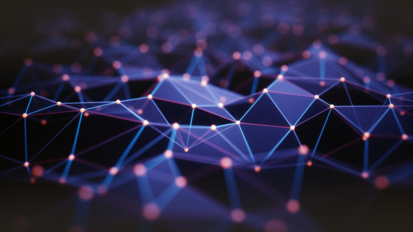
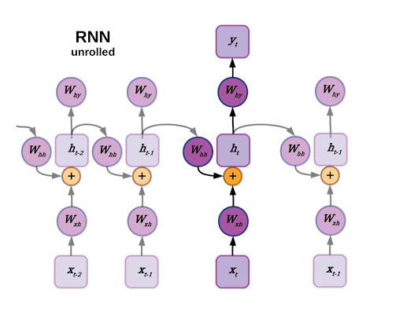

Bienvenue ! Voici ma synthèse sur les GNN, réalisée dans le cadre du MOS 4.4 "Nouvelles Technologies de l’Information et de la Communication" à l’École Centrale de Lyon - *Said Khaboud*

## Deep Learning sur les graphes

### Définition :
Les réseaux neuronaux graphiques (GNN) appartiennent à une catégorie de réseaux neuronaux qui fonctionnent naturellement sur des données structurées en graphes. Bien qu'il s'agisse d'un sujet qui cause un peu de confusion, les réseaux neuronaux graphiques peuvent être résumés en une poignée de concepts simples. Le but de cet article est d’expliquer ces principes et discuter des succès et perspectives de la technologie.

### Réseaux de neurones récurrents
Nous allons choisir un point de départ un peu plus familier : les réseaux neuronaux récurrents. Comme vous le savez, peut-être, les réseaux neuronaux récurrents sont bien adaptés aux données organisées en séquence, comme les données de séries chronologiques ou le langage. La caractéristique principale d'un réseau neuronal récurrent est que l'état d'un RNN dépend non seulement des entrées actuelles, mais aussi de l'état caché précédent du réseau. Les RNN ont fait l'objet de nombreuses améliorations au fil des ans. Ils entrent généralement dans la catégorie des RNN de type LSTM avec une fonction de déclenchement multiplicative entre l'état caché actuel et précédent du modèle. Un article discutant les variantes LSTM et leur relation avec les RNN classiques peut être trouvée [ici](https://www.exxactcorp.com/blog/Deep-Learning/5-types-of-lstm-recurrent-neural-networks-and-what-to-do-with-them).

Imaginez maintenant la séquence sur laquelle un RNN opère comme un graphe linéaire dirigé, mais enlevez les entrées et les connexions pondérées, qui seront intégrées comme des états de nœuds et des bords, respectivement. En fait, supprimez également la sortie. Dans un réseau neuronal à graphe, les données d'entrée sont l'état original de chaque nœud, et la sortie est analysée à partir de l'état caché après avoir effectué un certain nombre de mises à jour définies comme un hyperparamètre.

|  | 
|:--:| 
| *Ré imagination un RNN comme un réseau neuronal graphique sur un graphe acyclique linéaire* |

Tout d'abord, chaque nœud agrège les états de ses voisins. Cela peut se faire par des passages en avant à travers un réseau neuronal avec des poids partagés entre les bords, ou simplement en faisant la moyenne des vecteurs d'état de tous les nœuds adjacents. L'état caché précédent d'un nœud est également inclus dans cette agrégation de voisinage, mais bénéficie souvent d'un traitement spécial. L'état propre d'un nœud peut être analysé par sa propre couche cachée ou en l'ajoutant simplement au vecteur d'état calculé à partir de la moyenne de tous les états voisins. Il n'y a pas de concept de temps dans un GNN généralisé, et chaque nœud tire des données de ses voisins, qu'ils soient "devant" ou "derrière", bien que dans un graphe dirigé ou un graphe avec plusieurs espèces de connexions, les différents bords peuvent avoir leurs propres politiques d'agrégation. Un autre terme utilisé fréquemment pour décrire cette opération est : "Neural message passing".
En général, une epoch d’un GNN peut être simplifié en 2 étapes :
- Agrégation ou analyse des états des nœuds voisins ou "message passing".
- Mise à jour de l’état du nœud.

### Exemple d’application utile de GNN
Prenons un scénario réaliste (mais toujours simplifié) décrivant l’une des applications de réseaux neuronaux graphiques, pour voir comment ces structures peuvent mener à des résultats utiles. Supposons que nous voulions prédire quels atomes des résidus d'acides aminés sont hydrophiles (miscibles dans l'eau) par opposition à ceux qui sont hydrophobes, comme les huiles. Il s'agit d'une information importante pour déterminer comment les protéines se replient, une question difficile et fondamentale en biologie moléculaire. Prenons l'exemple de l'arginine, un acide aminé qui présente à la fois des caractéristiques hydrophiles et hydrophobes. Après avoir formulé la molécule sous forme de graphique comme suit :

|  | 
|:--:| 
| *Représentation graphique de l'arginine, un acide aminé amphipathique* |

Nous pouvons exécuter l'agrégation de voisinage et les mises à jour d'état pour obtenir une prédiction de l'hydrophilie à chaque nœud.
Un aspect intéressant de la chaîne latérale de l'arginine qui affecte cette double nature est que l'hydrophilie est distribuée sur les trois résidus amino contenant de l'azote dans la chaîne latérale. Le terme pour désigner cette disposition de trois atomes d'azote autour d'un carbone central est un groupe guanidino. Il est difficile d'imaginer capturer cette hydrophilie distribuée en considérant chaque nœud de manière isolée, mais c'est exactement le type d'information que l'on peut obtenir en incorporant les informations structurelles d'un graphe.

### Autres applications des GNN
Certes les réseaux de graphes neuronaux ont été [décrits en 2005](https://www.semanticscholar.org/paper/A-new-model-for-learning-in-graph-domains-Gori-Monfardini/9ca9f28676ad788d04ba24a51141a9a0a0df4d67) et les concepts reliés ont été évoqués avant cela, les GNN n’ont commencé à s'imposer que récemment. Ces dernières années, les GNN ont été adoptés avec enthousiasme dans l'analyse des réseaux sociaux et la chimie computationnelle, notamment pour la découverte de médicaments. Cependant, il n’est pas si tôt pour se familiariser avec les concepts des GNN, vu que les problèmes qui peuvent être facilement formulés sur des graphes deviennent de plus en plus fréquents.
L'une des premières applications des GNN était le classement des pages, aussi connu par [page ranking]( https://www.semanticscholar.org/paper/Graph-neural-networks-for-ranking-Web-pages-Scarselli-Yong/769bfd4a4b45979cf83bb56c054ebcaaaf8b35d7),pour la recherche sur le Web, mais ils ont parcouru un long chemin depuis lors. Le traitement du langage naturel et l'analyse syntaxique de la structure des phrases, une autre des premières applications, ont obtenu des résultats de pointe dans un test de synthèse de texte en 2010. Depuis, les GNN ont été utilisés pour tout, des [prévisions de trafic](https://deepmind.com/blog/article/traffic-prediction-with-advanced-graph-neural-networks) à la [chimie quantique](https://arxiv.org/abs/1704.01212).
Un autre exemple connu d’application des GNN est [HyperFoods]( https://www.nature.com/articles/s41598-019-45349-y), un article sur lequel a travaillé Michael Bronstein, un professeur dans le "Imperial College of london", l’un des fondateurs de ce concept et qui travaille toujours pour promouvoir la technologie et aider dans son implémentation dans plusieurs sujets de recherche.
### Perspectives des GNN
L'attention est un concept qui donne aux modèles d'apprentissage automatique la capacité d'apprendre à attribuer des poids différents aux différentes entrées, en d'autres termes, de donner aux modèles la capacité de gérer leur propre attention. Nous pouvons citer l'article de Vaswani et al. intitulé ["Attention is All You Need"](https://arxiv.org/abs/1706.03762) comme exemple de travaux récents dans ce domaine. L'article présentait le transformateur d'attention comme un modèle de langage polyvalent. Cela s'est avéré être vrai dans la plupart des cas avec le développement de modèles de transformateurs massifs comme BERT et GPT-3 qui ont dominé la métrique du langage naturel ces dernières années.
L'ajout de l'attention à l'algorithme GNN existant dont nous avons parlé précédemment est assez simple. Lors de l'agrégation de voisinage, en plus de la transformation des états des nœuds voisins via un réseau de feed-forward sur les arêtes du graphe, un mécanisme d'attention est inclus pour calculer les coefficients de pondération des vecteurs. Plusieurs mécanismes d'attention sont disponibles, comme celui du produit scalaire utilisé dans les modèles de transformation originaux, bien illustré par [Jay Allamar](https://jalammar.github.io/illustrated-transformer/). Dans ce schéma, les couches entièrement connectées produisent un vecteur clé et un vecteur de requête, en plus d'un vecteur de valeur pour chaque entrée, qui dans ce cas sont connectées aux nœuds par des arêtes de graphe. En prenant le produit scalaire des vecteurs clé et requête, on obtient une constante scalaire, qui est ensuite soumise à une fonction d'activation softmax avec tous les autres produits scalaires clé-requête dans le voisinage du graphe, c'est-à-dire les coefficients d'attention bruts. Enfin, au lieu d'additionner directement tous les vecteurs de valeur, ils sont d'abord pondérés par les coefficients d'attention.

|  | 
|:--:| 
| *Exemple d'un réseau d'un GAN utilisant le mécanisme d'attention par produit de points. Dans ce cas, σ représente la fonction softmax* |

### Les GNN quantiques
Si la chimie quantique sur les réseaux neuronaux à graphes est un moyen efficace de tirer parti de la structure moléculaire lors de la réalisation d'inférences sur la chimie quantique, définir les réseaux neuronaux d'un GNN comme un ansatz, ou une architecture de circuit quantique, peut rapprocher encore plus les modèles du système sur lequel ils font des prédictions et apprennent. Les réseaux neuronaux à graphes quantiques (QGNN) ont été présentés en 2019 par [Verdon et al.]( https://arxiv.org/abs/1909.12264) Les auteurs ont ensuite subdivisé leurs travaux en deux classes différentes : les réseaux neuronaux récurrents à graphes quantiques et les réseaux convolutifs à graphes quantiques.

Le type spécifique de circuit quantique utilisé par les QGNN relève de la catégorie des "algorithmes quantiques variationnels." En bref, il s'agit de circuits quantiques dont les paramètres peuvent être entraînés par descente de gradient, et ces paramètres entraînables sont l'équivalent quantique des poids et des biais. Un problème connu dans l'entraînement des algorithmes/circuits quantiques variationnels est la présence de ["barren plateaus"](https://arxiv.org/abs/1803.11173), c'est-à-dire de régions dans le paysage de l'aptitude où le score objectif ne change pas beaucoup. Les QGNN ont été conçus comme un moyen de transmettre des informations structurelles aux circuits quantiques variationnels afin d'améliorer la présence de plateaux stériles. Verdon et ses collègues ont présenté des QGNN appliqués à l'apprentissage de la dynamique quantique, au regroupement de graphes et à la classification des isomorphismes de graphes.

### Conclusion

Les graphes sont de puissantes abstractions mathématiques qui peuvent décrire des systèmes complexes de relations et d'interactions dans des domaines allant de la biologie et de la physique des hautes énergies aux sciences sociales et à l'économie. Comme la quantité de données structurées en graphes produites dans certains de ces domaines est aujourd'hui énorme, les réseaux sociaux comme Twitter et Facebook en sont des exemples notables, un exemple de ces graphes est le [Nebula Graph](https://dzone.com/articles/how-nebula-graph-stores-a-one-trillion-connections) de WeChat. Il est très tentant d'essayer d'appliquer ces techniques d'apprentissage profond qui ont connu un succès remarquable dans d'autres contextes riches en données.

